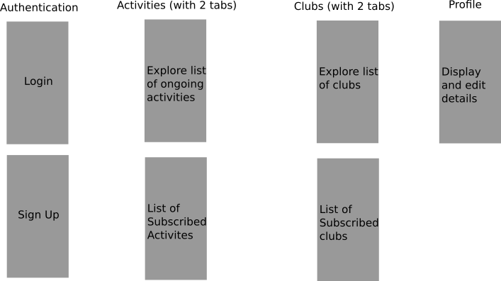

# NottCS Flutter

The mobile application which acts as a centre hub for students to manage their club and society activities.

## Technologies used

- Flutter
- Firebase

## Design

### User Interface and Experience

Above describe the user flow for the application.

Club and activites information would be added through an web admin panel for better control.

### Database

#### User Profile

- student id
- name
- year
- school of study (school of CS)
- clubs

#### Clubs

- name
- description
- activities
- club fees

#### Activites

- club
- starting datetime
- ending datetime
- participants
- name
- description
- fees
